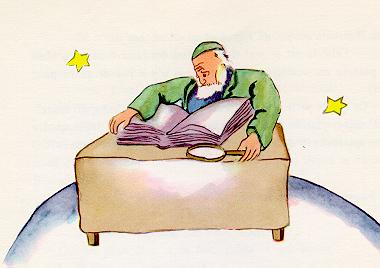

# XV

The sixth planet was ten times larger than the last one. It was
inhabited by an old gentleman who wrote voluminous books.

"Oh, look! Here is an explorer!" he exclaimed to himself when he saw
the little prince coming.

The little prince sat down on the table and panted a little. He had
already traveled so much and so far!

"Where do you come from?" the old gentleman said to him.

"What is that big book?" said the little prince. "What are you
doing?"

"I am a geographer," said the old gentleman.

"What is a geographer?" asked the little prince.

"A geographer is a scholar who knows the location of all the seas,
rivers, towns, mountains, and deserts."

"That is very interesting," said the little prince. "Here at last is
a man who has a real profession!" And he cast a look around him at the
planet of the geographer. It was the most magnificent and stately planet
that he had ever seen.

"Your planet is very beautiful," he said. "Has it any oceans?"

"I couldn't tell you," said the geographer.

"Ah!" The little prince was disappointed. "Has it any mountains?"

"I couldn't tell you," said the geographer.

"And towns, and rivers, and deserts?"

"I couldn't tell you that, either."

"But you are a geographer!"

"Exactly," the geographer said. "But I am not an explorer. I haven't
a single explorer on my planet. It is not the geographer who goes out to
count the towns, the rivers, the mountains, the seas, the oceans, and
the deserts. The geographer is much too important to go loafing about.
He does not leave his desk. But he receives the explorers in his study.
He asks them questions, and he notes down what they recall of their
travels. And if the recollections of any one among them seem interesting
to him, the geographer orders an inquiry into that explorer's moral
character."

"Why is that?"

"Because an explorer who told lies would bring disaster on the books of
the geographer. So would an explorer who drank too much."

"Why is that?" asked the little prince.

"Because intoxicated men see double. Then the geographer would note
down two mountains in a place where there was only one."

"I know some one," said the little prince, "who would make a bad
explorer."

"That is possible. Then, when the moral character of the explorer is
shown to be good, an inquiry is ordered into his discovery."

"One goes to see it?"

"No. That would be too complicated. But one requires the explorer to
furnish proofs. For example, if the discovery in question is that of a
large mountain, one requires that large stones be brought back from
it."

The geographer was suddenly stirred to excitement.

"But you---you come from far away! You are an explorer! You shall
describe your planet to me!"

And, having opened his big register, the geographer sharpened his
pencil. The recitals of explorers are put down first in pencil. One
waits until the explorer has furnished proofs, before putting them down
in ink.

"Well?" said the geographer expectantly.

"Oh, where I live," said the little prince, "it is not very
interesting. It is all so small. I have three volcanoes. Two volcanoes
are active and the other is extinct. But one never knows."

"One never knows," said the geographer.

"I have also a flower."

"We do not record flowers," said the geographer.

"Why is that? The flower is the most beautiful thing on my planet!"

"We do not record them," said the geographer, "because they are
ephemeral."

"What does that mean---'ephemeral'?"

"Geographies," said the geographer, "are the books which, of all
books, are most concerned with matters of consequence. They never become
old-fashioned. It is very rarely that a mountain changes its position.
It is very rarely that an ocean empties itself of its waters. We write
of eternal things."

"But extinct volcanoes may come to life again," the little prince
interrupted. "What does that mean----'ephemeral'?"

"Whether volcanoes are extinct or alive, it comes to the same thing for
us," said the geographer. "The thing that matters to us is the
mountain. It does not change."

"But what does that mean---'ephemeral'?" repeated the little prince,
who never in his life had let go of a question, once he had asked it.

"It means, 'which is in danger of speedy disappearance.'"

"Is my flower in danger of speedy disappearance?"

"Certainly it is."

"My flower is ephemeral," the little prince said to himself, "and she
has only four thorns to defend herself against the world. And I have
left her on my planet, all alone!"

That was his first moment of regret. But he took courage once more.

"What place would you advise me to visit now?" he asked.

"The planet Earth," replied the geographer. "It has a good
reputation."

And the little prince went away, thinking of his flower.
