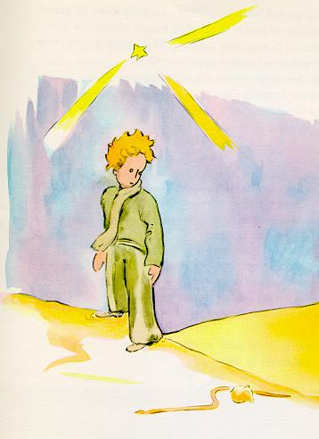

# XVII

When one wishes to play the wit, he sometimes wanders a little from the
truth. I have not been altogether honest in what I have told you about
the lamplighters. And I realize that I run the risk of giving a false
idea of our planet to those who do not know it. Men occupy a very small
place upon the Earth. If the two billion inhabitants who people its
surface were all to stand upright and somewhat crowded together, as they
do for some big public assembly, they could easily be put into one
public square twenty miles long and twenty miles wide. All humanity
could be piled up on a small Pacific islet.

The grown-ups, to be sure, will not believe you when you tell them that.
They imagine that they fill a great deal of space. They fancy themselves
as important as the baobabs. You should advise them, then, to make their
own calculations. They adore figures, and that will please them. But do
not waste your time on this extra task. It is unnecessary. You have, I
know, confidence in me.

When the little prince arrived on the Earth, he was very much surprised
not to see any people. He was beginning to be afraid he had come to the
wrong planet, when a coil of gold, the color of the moonlight, flashed
across the sand.

"Good evening," said the little prince courteously.

"Good evening," said the snake.

"What planet is this on which I have come down?" asked the little
prince.

"This is the Earth; this is Africa," the snake answered.

"Ah! Then there are no people on the Earth?"

"This is the desert. There are no people in the desert. The Earth is
large," said the snake.

The little prince sat down on a stone, and raised his eyes toward the
sky.

"I wonder," he said, "whether the stars are set alight in heaven so
that one day each one of us may find his own again... Look at my
planet. It is right there above us. But how far away it is!"

"It is beautiful," the snake said. "What has brought you here?"

"I have been having some trouble with a flower," said the little
prince.

"Ah!" said the snake.

And they were both silent.

"Where are the men?" the little prince at last took up the
conversation again. "It is a little lonely in the desert..."

"It is also lonely among men," the snake said.

The little prince gazed at him for a long time.

"You are a funny animal," he said at last. "You are no thicker than a
finger..."

"But I am more powerful than the finger of a king," said the snake.

The little prince smiled.

"You are not very powerful. You haven't even any feet. You cannot even
travel..."

"I can carry you farther than any ship could take you," said the
snake.

He twined himself around the little prince's ankle, like a golden
bracelet.

"Whomever I touch, I send back to the earth from whence he came," the
snake spoke again. "But you are innocent and true, and you come from a
star..."

The little prince made no reply.

"You move me to pity---you are so weak on this Earth made of granite,"
the snake said. "I can help you, some day, if you grow too homesick for
your own planet. I can---"

"Oh! I understand you very well," said the little prince. "But why do
you always speak in riddles?"

"I solve them all," said the snake.

And they were both silent.
