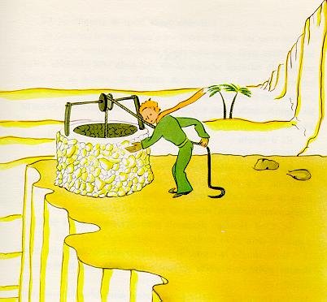

# XXV

"Men," said the little prince, "set out on their way in express
trains, but they do not know what they are looking for. Then they rush
about, and get excited, and turn round and round..."

And he added:

"It is not worth the trouble..."

The well that we had come to was not like the wells of the Sahara. The
wells of the Sahara are mere holes dug in the sand. This one was like a
well in a village. But there was no village here, and I thought I must
be dreaming...

"It is strange," I said to the little prince. "Everything is ready
for use: the pulley, the bucket, the rope..."

He laughed, touched the rope, and set the pulley to working. And the
pulley moaned, like an old weathervane which the wind has long since
forgotten.

"Do you hear?" said the little prince. "We have wakened the well, and
it is singing..."

I did not want him to tire himself with the rope.

"Leave it to me," I said. "It is too heavy for you."

I hoisted the bucket slowly to the edge of the well and set it
there---happy, tired as I was, over my achievement. The song of the
pulley was still in my ears, and I could see the sunlight shimmer in the
still trembling water.

"I am thirsty for this water," said the little prince. "Give me some
of it to drink..."

And I understood what he had been looking for.

I raised the bucket to his lips. He drank, his eyes closed. It was as
sweet as some special festival treat. This water was indeed a different
thing from ordinary nourishment. Its sweetness was born of the walk
under the stars, the song of the pulley, the effort of my arms. It was
good for the heart, like a present. When I was a little boy, the lights
of the Christmas tree, the music of the Midnight Mass, the tenderness of
smiling faces, used to make up, so, the radiance of the gifts I
received.

"The men where you live," said the little prince, "raise five
thousand roses in the same garden---and they do not find in it what they
are looking for."

"They do not find it," I replied.

"And yet what they are looking for could be found in one single rose,
or in a little water."

"Yes, that is true," I said.

And the little prince added:

"But the eyes are blind. One must look with the heart..."

&nbsp;

I had drunk the water. I breathed easily. At sunrise the sand is the
color of honey. And that honey color was making me happy, too. What
brought me, then, this sense of grief?

"You must keep your promise," said the little prince, softly, as he
sat down beside me once more.

"What promise?"

"You know---a muzzle for my sheep... I am responsible for this
flower..."

I took my rough drafts of drawings out of my pocket. The little prince
looked them over, and laughed as he said:

"Your baobabs---they look a little like cabbages."

"Oh!"

I had been so proud of my baobabs!

"Your fox---his ears look a little like horns; and they are too long."

And he laughed again.

"You are not fair, little prince," I said. "I don't know how to draw
anything except boa constrictors from the outside and boa constrictors
from the inside."

"Oh, that will be all right," he said, "children understand."

So then I made a pencil sketch of a muzzle. And as I gave it to him my
heart was torn.

"You have plans that I do not know about," I said.

But he did not answer me. He said to me, instead:

"You know---my descent to the earth... Tomorrow will be its
anniversary."

Then, after a silence, he went on:

"I came down very near here."

And he flushed.

And once again, without understanding why, I had a queer sense of
sorrow. One question, however, occurred to me:

"Then it was not by chance that on the morning when I first met you---a
week ago---you were strolling along like that, all alone, a thousand
miles from any inhabited region? You were on your way back to the place
where you landed?"

The little prince flushed again.

And I added, with some hesitancy:

"Perhaps it was because of the anniversary?"

The little prince flushed once more. He never answered questions---but
when one flushes does that not mean "Yes"?

"Ah," I said to him, "I am a little frightened---"

But he interrupted me.

"Now you must work. You must return to your engine. I will be waiting
for you here. Come back tomorrow evening..."

But I was not reassured. I remembered the fox. One runs the risk of
weeping a little, if one lets himself be tamed...
