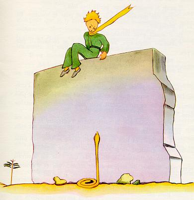
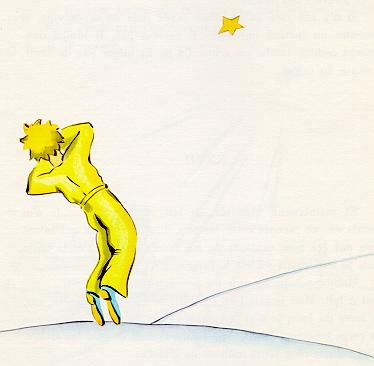

# XXVI

Beside the well there was the ruin of an old stone wall. When I came
back from my work, the next evening, I saw from some distance away my
little price sitting on top of a wall, with his feet dangling. And I
heard him say:

"Then you don't remember. This is not the exact spot."

Another voice must have answered him, for he replied to it:

"Yes, yes! It is the right day, but this is not the place."

I continued my walk toward the wall. At no time did I see or hear
anyone. The little prince, however, replied once again:

"---Exactly. You will see where my track begins, in the sand. You have
nothing to do but wait for me there. I shall be there tonight."

I was only twenty meters from the wall, and I still saw nothing.

After a silence the little prince spoke again:

"You have good poison? You are sure that it will not make me suffer too
long?"

I stopped in my tracks, my heart torn asunder; but still I did not
understand.

"Now go away," said the little prince. "I want to get down from the
wall."

I dropped my eyes, then, to the foot of the wall---and I leaped into the
air. There before me, facing the little prince, was one of those yellow
snakes that take just thirty seconds to bring your life to an end. Even
as I was digging into my pocked to get out my revolver I made a running
step back. But, at the noise I made, the snake let himself flow easily
across the sand like the dying spray of a fountain, and, in no apparent
hurry, disappeared, with a light metallic sound, among the stones.

I reached the wall just in time to catch my little man in my arms; his
face was white as snow.

"What does this mean?" I demanded. "Why are you talking with
snakes?"

I had loosened the golden muffler that he always wore. I had moistened
his temples, and had given him some water to drink. And now I did not
dare ask him any more questions. He looked at me very gravely, and put
his arms around my neck. I felt his heart beating like the heart of a
dying bird, shot with someone's rifle...

"I am glad that you have found what was the matter with your engine,"
he said. "Now you can go back home---"

"How do you know about that?"

I was just coming to tell him that my work had been successful, beyond
anything that I had dared to hope.

He made no answer to my question, but he added:

"I, too, am going back home today..."

Then, sadly---

"It is much farther... It is much more difficult..."

I realized clearly that something extraordinary was happening. I was
holding him close in my arms as if he were a little child; and yet it
seemed to me that he was rushing headlong toward an abyss from which I
could do nothing to restrain him...

His look was very serious, like some one lost far away.

"I have your sheep. And I have the sheep's box. And I have the muzzle..."

And he gave me a sad smile.

I waited a long time. I could see that he was reviving little by little.

"Dear little man," I said to him, "you are afraid..."

He was afraid, there was no doubt about that. But he laughed lightly.

"I shall be much more afraid this evening..."

Once again I felt myself frozen by the sense of something irreparable.
And I knew that I could not bear the thought of never hearing that
laughter any more. For me, it was like a spring of fresh water in the
desert.

"Little man," I said, "I want to hear you laugh again."

But he said to me:

"Tonight, it will be a year... My star, then, can be found right
above the place where I came to the Earth, a year ago..."

"Little man," I said, "tell me that it is only a bad dream---this
affair of the snake, and the meeting-place, and the star..."

But he did not answer my plea. He said to me, instead:

"The thing that is important is the thing that is not seen..."

"Yes, I know..."

"It is just as it is with the flower. If you love a flower that lives
on a star, it is sweet to look at the sky at night. All the stars are
a-bloom with flowers..."

"Yes, I know..."

"It is just as it is with the water. Because of the pulley, and the
rope, what you gave me to drink was like music. You remember---how good
it was."

"Yes, I know..."

"And at night you will look up at the stars. Where I live everything is
so small that I cannot show you where my star is to be found. It is
better, like that. My star will just be one of the stars, for you. And
so you will love to watch all the stars in the heavens... they will
all be your friends. And, besides, I am going to make you a present..."

He laughed again.

"Ah, little prince, dear little prince! I love to hear that laughter!"

"That is my present. Just that. It will be as it was when we drank the
water..."

"What are you trying to say?"

"All men have the stars," he answered, "but they are not the same
things for different people. For some, who are travelers, the stars are
guides. For others they are no more than little lights in the sky. For
others, who are scholars, they are problems. For my businessman they
were wealth. But all these stars are silent. You---you alone---will have
the stars as no one else has them---"

"What are you trying to say?"

"In one of the stars I shall be living. In one of them I shall be
laughing. And so it will be as if all the stars were laughing, when you
look at the sky at night... You---only you---will have stars that can
laugh!"

And he laughed again.

"And when your sorrow is comforted (time soothes all sorrows) you will
be content that you have known me. You will always be my friend. You
will want to laugh with me. And you will sometimes open your window, so,
for that pleasure...And your friends will be properly astonished to
see you laughing as you look up at the sky! Then you will say to them,
'Yes, the stars always make me laugh!' And they will think you are
crazy. It will be a very shabby trick that I shall have played on you..."

And he laughed again.

"It will be as if, in place of the stars, I had given you a great
number of little bells that knew how to laugh..."

And he laughed again. Then he quickly became serious:

"Tonight---you know... Do not come."

"I shall not leave you," I said.

"I shall look as if I were suffering. I shall look a little as if I
were dying. It is like that. Do not come to see that. It is not worth
the trouble..."

"I shall not leave you."

But he was worried.

"I tell you---it is also because of the snake. He must not bite you.
Snakes---they are malicious creatures. This one might bite you just for
fun..."

"I shall not leave you."

But a thought came to reassure him:

"It is true that they have no more poison for a second bite."

&nbsp;

That night I did not see him set out on his way. He got away from me
without making a sound. When I succeeded in catching up with him he was
walking along with a quick and resolute step. He said to me merely:

"Ah! You are there..."

And he took me by the hand. But he was still worrying.

"It was wrong of you to come. You will suffer. I shall look as if I
were dead; and that will not be true..."

I said nothing.

"You understand... it is too far. I cannot carry this body with me.
It is too heavy."

I said nothing.

"But it will be like an old abandoned shell. There is nothing sad about
old shells..."

I said nothing.

He was a little discouraged. But he made one more effort:

"You know, it will be very nice. I, too, shall look at the stars. All
the stars will be wells with a rusty pulley. All the stars will pour out
fresh water for me to drink..."

I said nothing.

"That will be so amusing! You will have five hundred million little
bells, and I shall have five hundred million springs of fresh water...

And he too said nothing more, becuase he was crying...

"Here it is. Let me go on by myself."

And he sat down, because he was afraid. Then he said, again:

"You know---my flower... I am responsible for her. And she is so
weak! She is so na&iuml;ve! She has four thorns, of no use at all, to protect
herself against all the world..."

I too sat down, because I was not able to stand up any longer.

"There now---that is all..."

He still hesitated a little; then he got up. He took one step. I could
not move.

There was nothing but a flash of yellow close to his ankle. He remained
motionless for an instant. He did not cry out. He fell as gently as a
tree falls. There was not even any sound, because of the sand.

